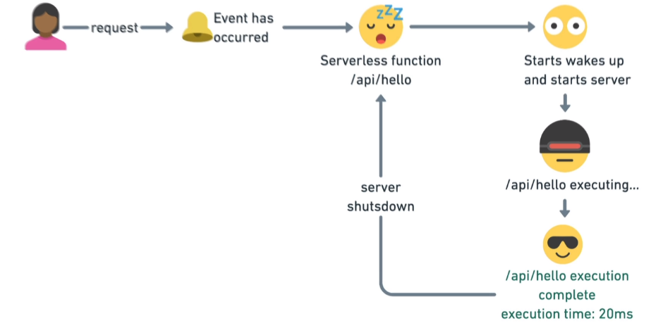

# Next: The good parts

## Different rendering techniques

### static site generation

best for static content

- the pages are rendered on the server
- cashed on CDN
- Served to the user from the nearest CDN

A huge boost in performance

#### getStaticProps

- only runs at build time (deployment)
- only runs on server side
- won't be included on client bundle (run hidden API calls)
- exported on page files only

#### getStaticPaths

prerender all the possible pages with dynamic routes like id

a page that uses dynamic routes, Next.js will statically pre-render all the paths specified by`getStaticPaths`.

it needs to define a list of paths that have to be rendered to HTML at build time.

You can also use a fallback to use when a path doesn't exist

- same as getStaticProps but it's for dynamic routes
- you need to give it the set of dynamic values (ex: ids) to be pre-rendered
- it should also export getStaticProps
- must have a fallback strategy
-

### Server-side rendering

best for dynamic content

- Render content on the server
- on every refresh, you're re-rendering content again on the server

### Incremental site regeneration

the best of both worlds

you can have static content + dynamic content

## NPX

node package runner

run executable files

## Performance in next

- code splitting
- minification
- Image optimization
- pre-fetch assets
- there's a node server configured for you so you can run serverless functions

## Next/link

built-in pre-fetching for links

use as to define params in the link like id

```jsx
<link as="/post/first" href="/post/[id]">
  <a>first</a>
</link>
```

## Next/router

declaratively route between pages

used to access params from the router

## \_documnet.js

special file

## custom server

opts out from optimization

## .env file

when it has `NEXT_PUBLIC` prefix it's shared with the client and can be accessed on the browser

when it's not it's only shared on the server

## Serverless functions



Serverless function workflow

Using API routes to implement serverless functions

### Rules for API Route

- the file needs to be a function
- the function needs to be exported by default
- every function should be it's own file
- use […slug] to catch all routes but it has the least priority than all the other routes
- can't be called inside `getStaticProps`
